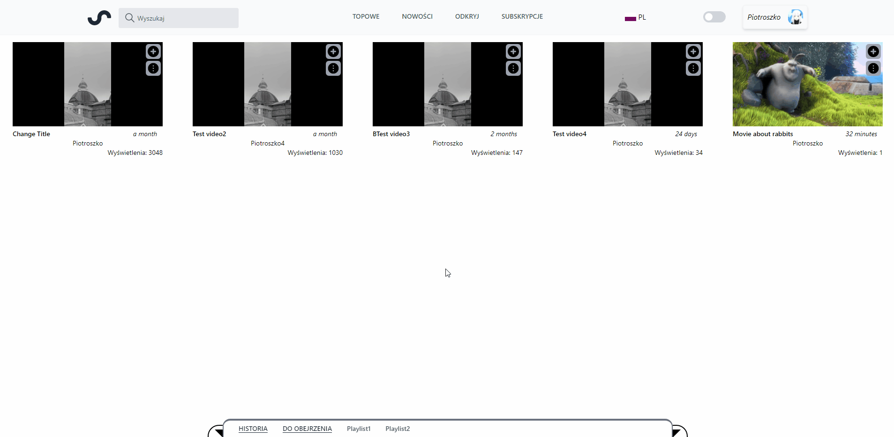

# VideoApp - portfolio project in React with Tailwind
## Features

- Light/dark mode toggle
- Multiple language support (ENG, PL)
- Responsive design using tailwind
- Custom video player
- Videos categories and custom playlists (History/"To watch"/User created custom playlists)
- Comments section for each video
- Like/Dislike system for videos and Comments
- Dynamic thumbnails generation (API) and preview on video hover
- Full auth system using JWT token including features like:
    - Login
    - Register
    - Forgot password
    - User profile password change
    - Endpoints token authorization
- User profile system:
    - User avatar
    - Subscribed channels list (with ability to subscribe/unsubscribe) with view to check new videos
    - List of user comments and created videos/videos templates

## Preview

- Light/dark mode toggle

## Authors

- [@linkedin - Piotr Roszkowski](https://www.linkedin.com/in/piotr-roszkowski-526853228/)
